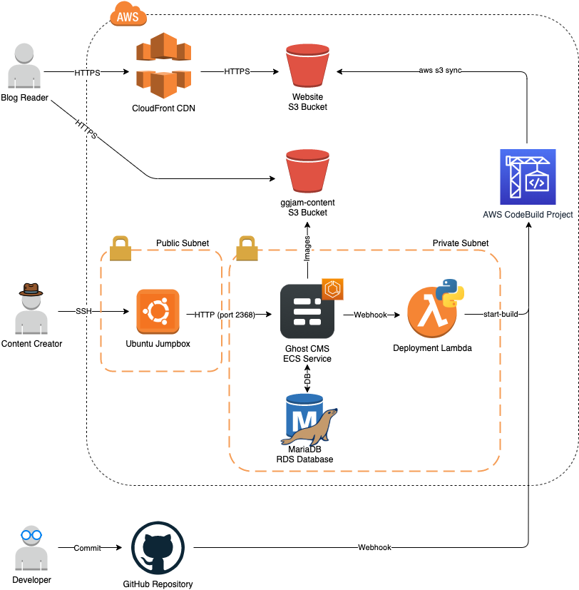

# GGJam - A Ghost/Gatsby Jamstack
This repo contains the AWS infrastructure, written in Terraform v0.12.24, for a Ghost/Gatsby Jamstack. A [Jamstack](https://jamstack.org) is an architecture for hosting static websites backed by a user-friendly content-management system. In this case, the static website generator I used is [Gatsby](https://www.gatsbyjs.com/), a React-based open-source framework for creating websites and apps. The backend CMS is [Ghost](https://ghost.org), a Node.js-based open-source content management system.

## Why Jamstack?

The JAM in Jamstack originally stood for Javascript, API, and Markup. Together, these three technologies can create a very simple and secure website architecture. Sites are delivered to the client as static HTML and Javascript files only, assmbled by a static site generator. Content can be created using user-friendly interfaces, which are accessed via REST API by the site generator at build time. Some of the simplest Jamstacks simply convert Markdown files into HTML, while more elaborate ones like GGJam allow content creators to take advantage of the friendly UX offered by a full-featured CMS. 

There are numerous advantages to this approach:
* **Speed:** The client-side Javascript does not need to request content from a remote API at load time, eliminating a common traffic bottleneck. Since the client-side content is completely contained in the static site, the client's browser only has to download the files (and additional media like images) for a page, and then it has that page.
* **Security:** Because there is no need for the client-side content to reach out to a public-facing REST API while in use, one of the most serious security weaknesses of websites is avoided entirely. The API is accessed only at build-time by the static site generator, which can both be located entirely in a private network. The client-side content is simply a set of static files which can be served from read-only storage.
* **Convenience:** Despite the fact that the clent-side content is a static site, a Jamstack allows content creators to write and manage their content in a user-friendly interface. They don't have to manually write HTML or know any Javascript to add the content they want.
* **Customization:** A static site generator can be customized to create any client-side experience desired, whether matching the styles of another site, offering the site in multiple styles, or creating something completely unique. Creators are not limited to the themes and basic customizations offered by the CMS provider.

There are a couple of disadvantages to the Jamstack approach, when compared to other site architectures:
* **Updating:** Because the client-side site is statically generated, it can't be instantly updated by content creators. Changes made by content creators won't be incorporated until the static site generator is run again. This issue can be mitigated by creating a CI/CD pipeline, triggered whenever an update is made to content in the CMS. That's the approach taken by GGJam.
* **Non-interactive:** The static-site approach may not be the best approach for sites that require a high amount of interaction with backend systems, since the client-side code is meant to run independently on the client's machine. Jamstack sites are great for use cases like blogs and other sites with content that doesn't change frequently. 
* **Setup:** Jamstacks require a little more setup and customization than just using a CRM product alone. It's completely possible, of course, to use a CMS like [Ghost](https://ghost.org) alone, customizing the public-facing site with templates. This approach may be simpler to set up, but it would mean that the system running your CMS is exposed to the public Internet, which may not be desirable.

## GGJam Architecture

This repo contains two different architectures for GGJam:
* The `main` branch contains the complete CI/CD pipeline and supporting infrastructure for running Ghost and Gatsby securely in AWS, in addition to hosting their site with S3 and CloudFront. Automated deployments are triggered by updates to the frontend's GitHub repo, and by content updates in Ghost.
* The `minimal` branch contains a much simpler architecture, for those who prefer to run Ghost and Gatsby locally, and use AWS only for hosting the static site. Build and deployments are manual.

The AWS architecture for the full-fledged deployment of GGJam is illustrated by this diagram:

This diagram illustrates the user journeys of three different types of stakeholders:
* **Content Conusmers** access the frontend static site via AWS CloudFront CDN, which distributes the contents of the website S3 bucket. Supplemental media (images, etc.) are retrieved directly from a content S3 bucket.
* **Content Creators** access the Ghost CMS in its private subnet to add, modify, delete, and update their content. When they upload images or other media to Ghost, it is stored in the same S3 bucket that clients will retrieve it from. When they publish content, the change will trigger a deployment Lamba function that will start the frontend Codebuild project, which rebuilds and redeploys the site. In this demo infrastructure, access to the private network is provided via jumpbox, but it could also be accessed via a client VPN or easily linked to an on-premise network using site-to-site VPNs.
* **Developers** push code changes to GitHub, which trigger the Codebuild pipeline and redeploy the site. 

### Repositories
* [GGJam](https://github.com/wunderhund/ggjam): 
* [GGJam-frontend](https://github.com/wunderhund/ggjam-frontend):
* [GGJam-backend](https://github.com/wunderhund/ggjam-backend): 

### Files
* `terraform.tfvars`: Variable values file, which is ignored by git to allow secrets to be stored in it locally. Copy the `terraform.tfvars.example` file to create your own `terraform.tfvars` file and customize it to your needs.
* `main.tf`: Contains providers and some data variables.
* `network.tf`: Configures the VPC, subnets, NAT gateways, route tables & routes.
* `gatsby.tf`: All the infrastructure for the Gatsby static site generator.
* `ghost.tf`: All the infrastructure for the Ghost CMS.
* `jumpbox.tf`: Configuration for the optional jumpbox. Can be omitted if access to the Ghost CMS is handled through a VPN or other connection.
* `mariadb.tf`: Setup for the MariaDB that stores the user content for Ghost, including the blog posts and other configuration.
* `outputs.tf`: Outputs of values that might be needed, like the S3 website URL,the Content S3 bucket URL, Content S3 bucket name, and the Jumpbox's Pulic IP address.
* `variables.tf`: Creates all the variables.
* `webhook.tf`: Creates GitHub webhooks for the CI/CD pipelines.

## Using this Demo Infrastructure
### Things you'll need
* **AWS Account:** If you don't already have an AWS account, [create one](https://aws.amazon.com/resources/create-account/)
* **GitHub Account:** [Join GitHub](https://github.com/join)
* **GitHub Personal Access Token:** Instructions for generating a personal GitHub token can be found [here](https://help.github.com/en/github/authenticating-to-github/creating-a-personal-access-token-for-the-command-line).
* **awscli:** [Install the AWS CLI](https://docs.aws.amazon.com/cli/latest/userguide/cli-chap-install.html).
* **Terraform:** [Install Terraform](https://learn.hashicorp.com/tutorials/terraform/install-cli).
* **DNS Name:** This Infrastructure-as-Code doesn't include Route53 configuration, and was designed to be used with already-owned DNS names. You can add them yourself using the [aws_route53_zone](https://registry.terraform.io/providers/hashicorp/aws/latest/docs/resources/route53_zone) and [aws_route53_record](https://registry.terraform.io/providers/hashicorp/aws/latest/docs/resources/route53_record) resources, or use your favorite DNS registrar to create your site's domain name.

### Variable Values
In order to run this Terraform, you'll need to choose values for all of the variables represented in `variables.tf`. I've provided an example `terraform.tfvars` file named `terraform.tfvars.example` to serve as a guide. Briefly, here are what all the variables do:
* `profile`: AWS Profile to use in ~/.aws/credentials file. See the [AWS Provider documentation](https://registry.terraform.io/providers/hashicorp/aws/latest/docs)
* `region`: AWS Region to build the infrastructure in. See [AWS Regions and Availability Zones](https://aws.amazon.com/about-aws/global-infrastructure/regions_az/)
* `base_tags`: Tags that will be applied to every resource that supports tags.
* `site_name`: This will be used as the name of your website S3 bucket and to configure Ghost. It should match your actual DNS name for the site!
* `ghostdb_user`: A username for the ghost UI. Defaults to "ghost".
* `ghostdb_pass`: A password for the ghost UI.
* `ghostdb_database`: Ghost Database name. Defaults to "ghost".
* `ghostdb_client`: Database engine used. Defaults to "mysql".
* `ghost_port`: Port Ghost will be accessed on. Defaults to "2368".
* `ghost_api_key`: Content API key, used by the frontend to pull content from Ghost. This is only available after setting up Ghost; you generate them on the **Integrations** menu. See the [Ghost Content API](https://ghost.org/docs/content-api/) documentation.
* `jumpbox_access`: IP Addresses for the jumpbox allowlist. Only traffic from these IPs will be able to access the backend environment.
* `jumpbox_key`: = SSH Public Key to be used for access to the jumpbox. An SSH keypair can be generated with [keygen](https://www.ssh.com/ssh/keygen/).
* `gatsby_repo`: = Repository that Gatsby will be pulled from. If using a custom repo like [ggjam-frontend](https://github.com/wunderhund/ggjam-frontend), set this variable to that URL. Otherwise, it defaults to `https://github.com/TryGhost/gatsby-starter-ghost.git`.
* `content_s3_bucket`: Bucket name for your media content. This bucket will contain your images, themes, etc.
* `github_personal_token`:Only needed if you are using a private [Gatsby](https://www.gatsbyjs.com/) repo. Instructions for generating a personal GitHub token can be found [here](https://help.github.com/en/github/authenticating-to-github/creating-a-personal-access-token-for-the-command-line)
* `github_secret_string`: Secret string for GH Webhooks. Used with GH Enterprise only.
* `github_owner`: GitHub Enterprise Organization. Used with GH Enterprise only.

### Build Order
Because there's no automated way to get the Ghost Content API Key before the container is up and running, this infrastructure requires at least some manual intervention. If all of the variables are set correctly, it should all build correctly with a single `terraform apply`. However, the Gatsby frontend builder will not be able to pull content from the Ghost Content API until it has that key.

Although the Terraform resource dependency mapping is pretty good, if you want to work through this process one step at a time, here is the suggested build order:
1. `main.tf` 
1. `network.tf`
1. `jumpbox.tf`
1. `mariadb.tf`
1. `ghost.tf`
1. `gatsby.tf`
1. `webhook.tf`

### Acknowledgements:
[Gatsby](https://www.gatsbyjs.com/)
[Ghost](https://ghost.org/)
[gatsby-starter-ghost](https://github.com/TryGhost/gatsby-starter-ghost.git)
Lambda webhook inspired by: https://www.linkedin.com/pulse/use-aws-codecommit-lambda-trigger-codebuild-container-trevor-sullivan/
